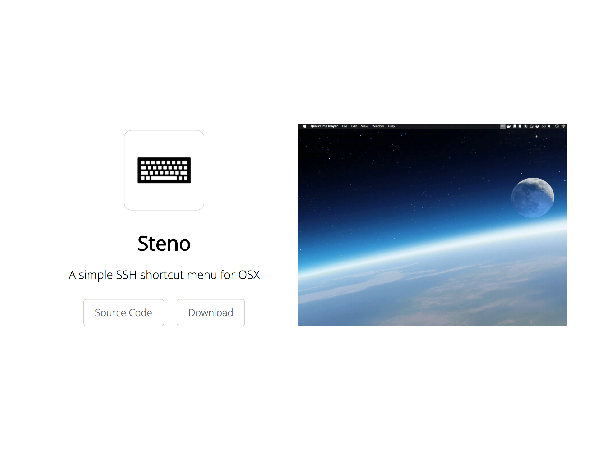

# tryitout

> 🎩 a way to build interactive doc pages with configuration files

[](https://travis-ci.org/gabrielcsapo/tryitout)
[](https://starbuck.gabrielcsapo.com/github/gabrielcsapo/tryitout)
[](https://starbuck.gabrielcsapo.com/github/gabrielcsapo/tryitout#info=devDependencies)
[](https://lcov-server.gabrielcsapo.com/coverage/github%2Ecom/gabrielcsapo/tryitout)
[]()
[]()


<!-- TOC depthFrom:2 depthTo:7 withLinks:1 updateOnSave:1 orderedList:0 -->

- [Installation](#installation)
- [Description](#description)
- [Usage](#usage)
- [Templates](#templates)

<!-- /TOC -->

## Installation

```
npm install tryitout --save-dev
```

## Description

Do you have a cool client side library that you want to show a quick tutorial about how to use it?

What if you could build a quick demo application with the following;

_tryitout.json_
```json
{
    "title": "Hello World",
    "description": "When you want a hello world example and just want a simple example cli",
    "nav": {
      "Source": "https://github.com/gabrielcsapo/tryitout",
      "Docs": "https://github.com/gabrielcsapo/tryitout/docs"
    },
    "body": [{
      "type": "text",
      "value": "To write a simple hello world function simply do the following"
    },{
      "type": "code",
      "title": "Hello World Example",
      "value": "function Hello() {\n    return 'hello world'\n}"
    }],
    "output": "./docs"
}
```

or it can also be a `js` file that exports an object

_tryitout.js_
```js
module.exports = {
    title: "Hello World",
    description: "When you want a hello world example and just want a simple example cli",
    nav: {
      Source: "https://github.com/gabrielcsapo/tryitout",
      Docs: "https://github.com/gabrielcsapo/tryitout/docs",
    },
    body: [{
      type: "text",
      value: `
        To write a simple hello world function simply do the following
      `
    },{
      type: "code",
      title: "Hello World Example",
      value: `
        function Hello() {
          return 'hello world'
        }
      `
    }],
    output: "./docs"
}
```

> If you create a file named `tryitout.json` or `tryitout.js` all you have to do is call `tryitout` and it will pick up that file by default in the current working directory.

## Usage

```
Usage: tryitout [options]


Options:

  -V, --version              output the version number
  -s, --source <source>      The source json file that explain what you want to try out (the default files that it will look for will be tryitout.json or tryitout.js)
  -o, --output [directory]   The output directory
  -w, --watch                Watch for changes and compile when changes are made
  -t, --template <template>  The template to be used to generate your site
  -h, --help                 output usage information
```

To quickly prototype an example create a `tryitout.js` file in the current working directory with the contents:

```js
module.exports = {
    title: "Hello World",
    description: "When you want a hello world example and just want a simple example cli",
    nav: {
      Source: "https://github.com/gabrielcsapo/tryitout",
      Docs: "https://github.com/gabrielcsapo/tryitout/docs",
    },
    body: [{
      type: "text",
      value: `
        To write a simple hello world function simply do the following
      `
    },{
      type: "code",
      title: "Hello World Example",
      value: `
        function Hello() {
          return 'hello world'
        }
      `
    }]
}
```

Once the file has been created, running `tryitout --watch` will start a server that will produce a working version of the site. Any changes made to `tryitout.js` will be reflected in the page after reload.

## Templates

To expand the use cases for this utility templates have been added to give more flexibility in the output.

For example to generate a code demo page you could simply use:

```js
{
    title: "Hello World",
    description: "When you want a hello world example and just want a simple example cli",
    nav: {
      Source: "https://github.com/gabrielcsapo/tryitout",
      Docs: "https://github.com/gabrielcsapo/tryitout/docs",
    },
    body: [{
      type: "text",
      value: `
        To write a simple hello world function simply do the following
      `
    },{
      type: "code",
      title: "Hello World Example",
      value: `
        function Hello() {
          return 'hello world'
        }
      `
    }]
}
```

but if one wanted to generate a product page you could use:

```js
{
  title: "Steno",
  description: "A simple SSH shortcut menu for OSX",
  icon: './test/fixtures/steno.png',
  demoImage: './test/fixtures/example.gif',
  links: {
    Source: 'https://github.com/gabrielcsapo/steno',
    Download: 'https://github.com/gabrielcsapo/steno/releases',
  }
}
```

and get this:


